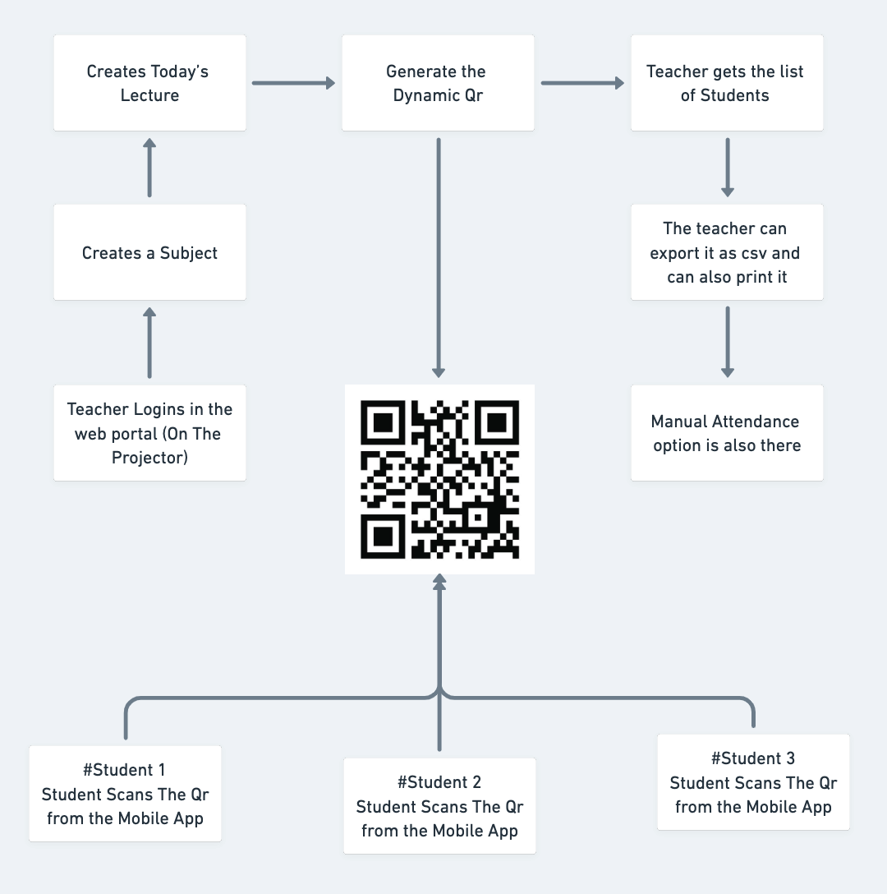
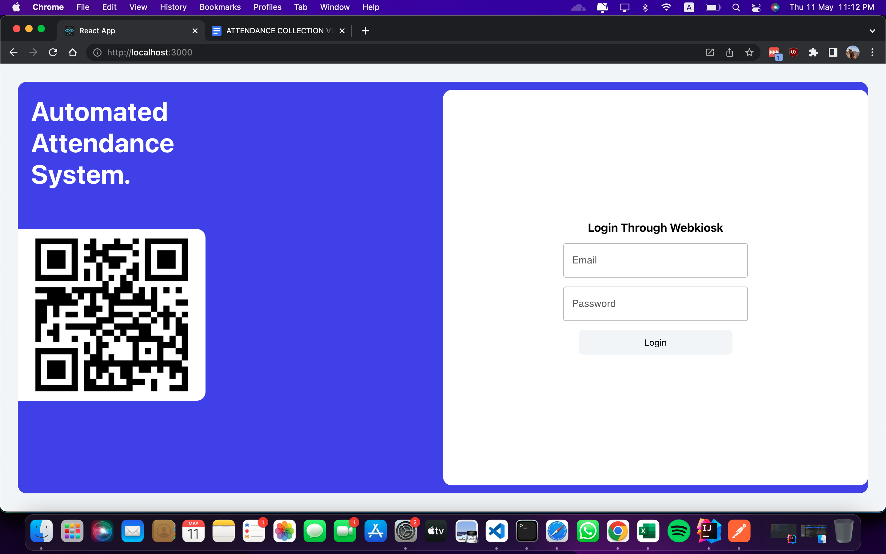
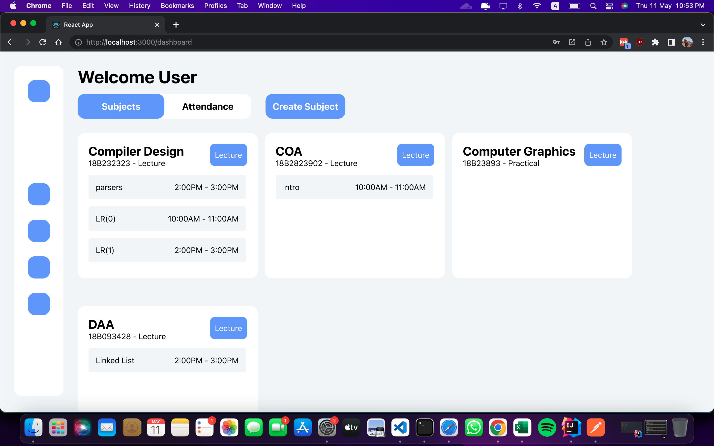
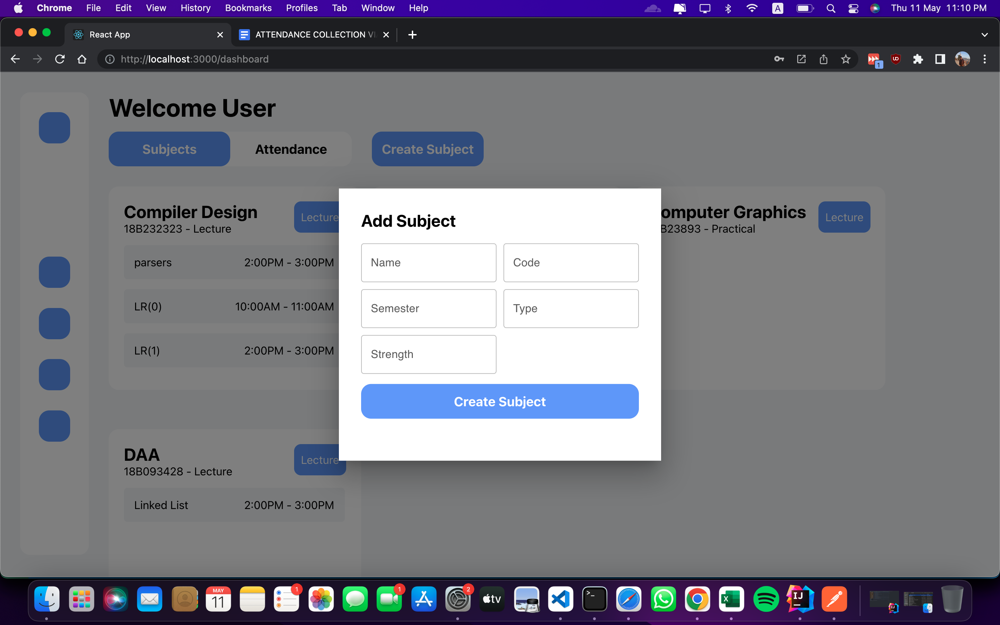
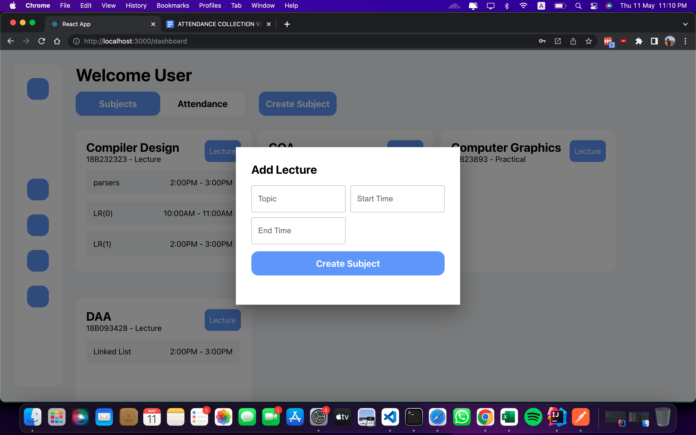
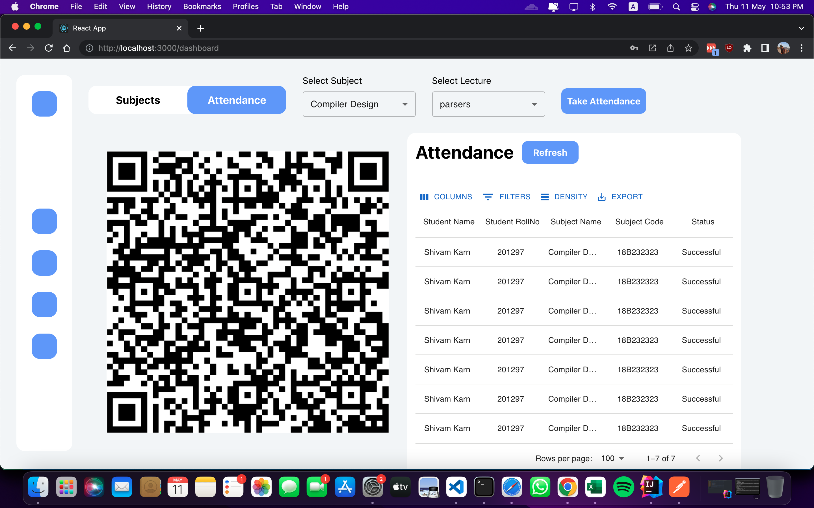

## Automated Attendance System

   

Automated Attendance System, Saves Time and Eliminates Proxies :)

Frontend (Web Portal) : https://github.com/aarhank/Automated-Attendance-System

Backend : https://github.com/aarhank/Automated-Attendance-Backend

Mobile App : https://github.com/aarhank/JUIT-Attendance-App

JUIT WebScraper : https://github.com/aarhank/JUIT-WebKiosk-API

### Overview

A Automated Attendance System, to reduce time taken during manual attendance and make the whole process more seamless and smooth.

Application consists of a Frontend(web portal), a Backend and a Mobile App, Backend made using springboot with a fully scalable code database using AWS RDS, Frontend is made using reactJS made use of mui library to design responsive components.

The Mobile App is made using React-Native which makes is compatible with both android and ios, Also integrated this app with a web scraper to fetch the current data of the student live from the college web portal.

This project got the First prize in the Expanse Hackathon ( College Tech Fest ). Further developments were done in collaboration with the college faculty.

### The Whole Flow

### Features

* The Dynamic Qr which is being used completely eliminates proxy attendances.
  The QR changes every 5 seconds; hence, the previous QR becomes invalid and cannot be shared or circulated.

* It makes it easier to take attendance because the whole process takes less than 5 minutes to complete.
  The attendance is saved in the database and can be exported as a csv for other uses, which in general makes it hassle free for the professors.
  
* The Mobile App provides all the current academic details of the student, which he can directly scan
  the QR code and mark himself as present.

* Extra Steps which are taken to prevent proxies are the fingerprint scanner (or the Face id in Apple devices) 
  to know if the student is present in the class and has not given his cell phone to another student
  
* Manual Attendance option was added on the teachers end.
  Imagine if any student has network issues or has forgotten his cell phone.

### Backend Design

soon

### Login Page

### Dashboard

### Create Subject

### Create Lecture

### Attendance Screen

